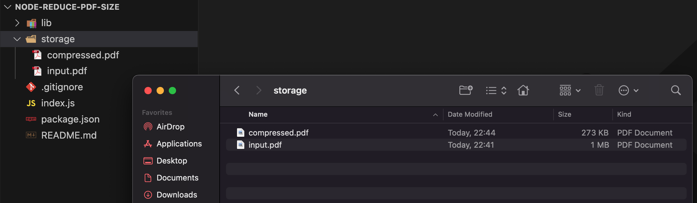

# Reduce PDF Size

I've created a code snippet that demonstrates how to compress a PDF file using `gs`.

## Ghostscript

Ghostscript (often abbreviated as GS) is a high-quality interpreter for PostScript and Portable Document Format (PDF) languages. It is widely used for tasks like viewing PDFs, converting between different document formats, printing, and even creating PDFs. Ghostscript can be used from the command line, as part of a pipeline, or within programs written in various programming languages.

## Example Usage:

Here's a simple example that uses Ghostscript to compress a PDF file:

> gs -sDEVICE=pdfwrite -dCompatibilityLevel=1.4 -dPDFSETTINGS=/ebook -dNOPAUSE -dQUIET -dBATCH -sOutputFile=output.pdf input.pdf

In this example:

- `-sDEVICE=pdfwrite` specifies that the output should be a PDF.
- `-dCompatibilityLevel=1.4` sets the PDF version for the output file.
- `-dPDFSETTINGS=/ebook` sets the quality and size of the output PDF.
- `-dNOPAUSE` and -dQUIET are used to run the command without manual intervention and minimal output.
- `-dBATCH` is used to process all the files and exit.
- `-sOutputFile=output.pdf` specifies the name of the output file.
- `input.pdf` is the input PDF file to be compressed.

### How to Run

```sh
node index.js
```

Results:

